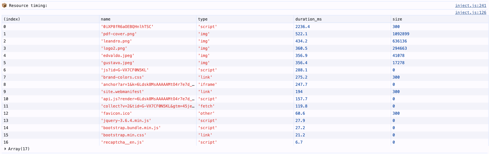
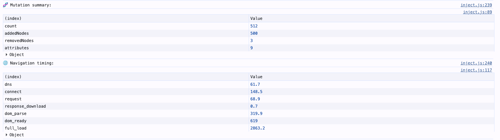
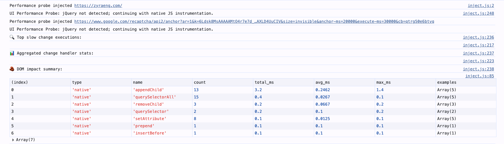
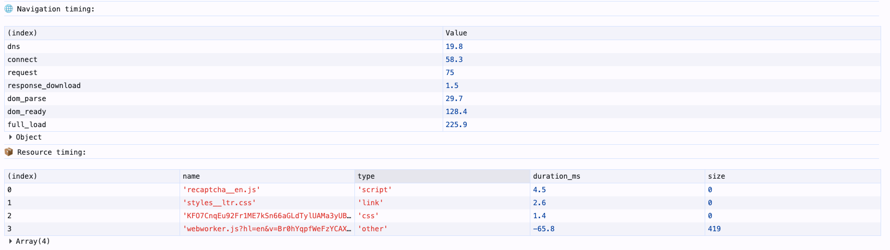

# ui-performance-probe

A lightweight Chrome extension that injects a frontend performance probe into web pages to identify JavaScript/UI lag, slow event handlers, DOM mutation pressure, AJAX duration, long tasks, navigation timing, and resource timing.

## What It Does

This extension instruments your page to measure:

- **Event Handler Performance**: Tracks slow jQuery event handlers (`.on()`) and aggregates by name, element, and event type
- **DOM Operation Impact**: Measures jQuery and native DOM method duration (append, remove, querySelector, etc.)
- **Mutation Pressure**: Counts DOM mutations and attribute changes to identify aggressive DOM manipulation
- **Long Tasks**: Detects JavaScript tasks exceeding 50ms using the PerformanceObserver API
- **AJAX Duration**: Logs all jQuery AJAX calls with their duration and URL
- **Navigation Timing**: Reports DNS, connect, request, response, and DOM parse times
- **Resource Timing**: Shows slowest resources (scripts, stylesheets, images, etc.)

All measurements are logged to the browser console. **No data is sent anywhere—everything stays in your page.**

## Installation

### For Development/Testing (Unpacked Extension)

1. Clone or download this repository
2. Open Chrome and navigate to `chrome://extensions/`
3. Enable **Developer mode** (toggle in top-right corner)
4. Click **Load unpacked**
5. Select the extension folder (where `manifest.json` is located)
6. The extension will appear in your toolbar

You can now click the extension icon on any page to inject the probe.

### For Publishing to Chrome Web Store

⚠️ **Not yet prepared for Web Store submission.** To publish, you'll need:
- Add 16×16, 48×48, and 128×128 PNG icons to the folder
- Reference them in `manifest.json`:
  ```json
  "icons": {
    "16": "images/icon-16.png",
    "48": "images/icon-48.png",
    "128": "images/icon-128.png"
  }
  ```
- Create a Chrome Developer account and follow Web Store submission guidelines

## Usage

### Auto Report (8 seconds)

By default, 8 seconds after the page loads, the extension logs an automatic summary to the console:

```
🔍 Top slow change executions:
📊 Aggregated change handler stats:
🧱 DOM impact summary:
🧬 Mutation summary:
🌐 Navigation timing:
📦 Resource timing:
```

### Manual Console Commands

After injection, use these window functions in the browser console:

#### **`window.__changeHandlerTop(limit=20)`**
Returns and displays the top N slowest event handler executions.
```javascript
window.__changeHandlerTop(10);
// Returns:
// [{name, time_ms, element, event, source}, ...]
```

#### **`window.__changeHandlerSummary()`**
Aggregated statistics for all event handlers (count, total, avg, max).
```javascript
window.__changeHandlerSummary();
// Returns:
// [{name, count, total_ms, avg_ms, max_ms}, ...]
```

#### **`window.__changeHandlerRaw()`**
Full raw data for all event handler executions (unfiltered, unsorted).
```javascript
window.__changeHandlerRaw();
// Returns:
// [{name, time, element, event, source, stack}, ...]
```

#### **`window.__changeHandlerFor(elementId)`**
Filter handler executions by element ID or handler name.
```javascript
window.__changeHandlerFor('myButton');
```

#### **`window.__domImpactSummary()`**
Aggregated statistics for jQuery and native DOM method calls.
```javascript
window.__domImpactSummary();
// Returns:
// [{type, name, count, total_ms, avg_ms, max_ms, examples}, ...]
```

#### **`window.__mutationSummary()`**
DOM mutation statistics (added nodes, removed nodes, attribute changes).
```javascript
window.__mutationSummary();
// Returns:
// {count, addedNodes, removedNodes, attributes}
```

#### **`window.__navigationTiming()`**
Page load phases (DNS, connect, request, response, DOM parse, DOMContentLoaded, full load).
```javascript
window.__navigationTiming();
// Returns:
// {dns, connect, request, response_download, dom_parse, dom_ready, full_load}
```

#### **`window.__resourceTiming(limit=30)`**
Slowest resources loaded on the page (scripts, stylesheets, images, etc.).
```javascript
window.__resourceTiming(20);
// Returns:
// [{name, type, duration_ms, size}, ...]
```

## API Reference

### Console Helper Functions (Complete)

All functions are automatically exposed to `window` after the probe injects (typically within 1–3 seconds on jQuery pages).

| Function | Purpose | Returns |
|----------|---------|---------|
| `__changeHandlerTop(limit=20)` | Top N slowest event handler executions | Array of {name, time_ms, element, event, source} |
| `__changeHandlerSummary()` | Aggregated stats for all handlers | Array of {name, count, total_ms, avg_ms, max_ms} |
| `__changeHandlerRaw()` | Raw, unprocessed handler log | Array of {name, time, element, event, source, stack} |
| `__changeHandlerFor(elementId)` | Filter handlers by element/name | Filtered array sorted by time |
| `__domImpactSummary()` | jQuery and native DOM method stats | Array of {type, name, count, total_ms, avg_ms, max_ms, examples} |
| `__mutationSummary()` | DOM mutation counts | {count, addedNodes, removedNodes, attributes} |
| `__navigationTiming()` | Page load breakdown | {dns, connect, request, response_download, dom_parse, dom_ready, full_load} |
| `__resourceTiming(limit=30)` | Slowest resources loaded | Array of {name, type, duration_ms, size} |

### Event Handler Tracking

The probe wraps `$.fn.on()` to measure all jQuery event handler execution times.

**What's measured:**
- Time to execute each event handler
- Handler name (or "anonymous @ element-id" if unnamed)
- Target element (by id, name, or tagName)
- Event type (click, change, etc.)
- Call stack (first 3 non-probe lines)

**What's excluded:**
- Handlers with execution time < 1ms (configurable via `MIN_LOG_MS` in source)

### DOM Operation Tracking

The probe wraps jQuery methods and native DOM APIs to measure method execution time.

**jQuery methods wrapped:**
find, each, val, attr, prop, data, html, text, append, prepend, empty, show, hide, toggle, addClass, removeClass, toggleClass, css, parent, parents, children, closest, remove, detach, clone, before, after

**Native DOM APIs wrapped:**
- Element: append, prepend, remove, before, after, setAttribute, querySelector, querySelectorAll
- Node: appendChild, removeChild, insertBefore
- Document: querySelector, querySelectorAll

### Mutation Monitoring

The probe uses a MutationObserver to track DOM changes:
- Total mutation events
- Nodes added
- Nodes removed
- Attribute changes

**Observed on:** `document.documentElement` (entire document tree)

### Long Task Detection

Automatically detects JavaScript tasks exceeding 50ms using the PerformanceObserver API.

**Output:** Logged as warnings in console with duration and start time

### AJAX Monitoring

Wraps `$.ajax()` to measure request duration from initiation to completion (success, error, or abort).

**Measured:** Request URL and total duration (ms)

### Navigation & Resource Timing

Uses the standard Performance Timing APIs to report:
- Page load phases (DNS, connect, request, response, DOM parse)
- Individual resource durations (scripts, stylesheets, images, fonts, etc.)

## Usage Examples

### Find the slowest event handler on your page
```javascript
window.__changeHandlerTop(1);
// Returns the single slowest execution
```

### Drill into a specific button's performance
```javascript
window.__changeHandlerFor('submitButton');
// Shows all executions for element with id='submitButton'
```

### Check if DOM operations are the bottleneck
```javascript
const dom = window.__domImpactSummary();
const handler = window.__changeHandlerSummary();
// Compare total_ms to identify if DOM ops or handlers are slower
```

### Monitor AJAX latency across page interactions
```javascript
// AJAX times are automatically logged to console as they complete
// Manually check individual results:
window.__changeHandlerRaw()
  .filter(r => r.event === 'click')
  .slice(0, 5)
// Shows the 5 most recent click handlers
```

### Check page load performance
```javascript
const timings = window.__navigationTiming();
// Identify slow page load phase (DNS, parse, request, etc.)
console.log(`Total page load: ${timings.full_load}ms`);
```

### Find slow-loading resources
```javascript
window.__resourceTiming(10);
// Shows top 10 slowest resources
```

## Screenshots

Below are example screenshots from the probe UI and console output (click to expand):

- Screenshot 1
  
  

- Screenshot 2
  
  

- Screenshot 3
  
  

- Screenshot 4
  
  


## Known Limitations

- **Requires jQuery** on the target page. If jQuery is not detected within 30 seconds, the probe gives up silently and does not interfere with the page.
- **Event handlers only** for jQuery: Wraps `$.fn.on()` but does not instrument `addEventListener` directly (can be added if needed).
- **Approximate measurements**: The probe adds minimal overhead, but wrapping functions inherently adds nanoseconds to execution time.
- **Raw logs capped at 1000**: To prevent unbounded memory growth on long-running pages, only the last 1000 raw handler executions are kept.
- **Not suitable for production**: This is a development/debugging tool. Use it locally or in staging environments, not in production code delivery.

## Performance Impact

The extension has minimal performance overhead:

- Wrapping jQuery methods adds **< 1ms per call** (typical: 0.01–0.5ms)
- MutationObserver runs asynchronously without blocking the main thread
- PerformanceObserver for long tasks is passive (read-only)
- Auto-report at 8 seconds logs data but does not affect subsequent page activity

**However**, the act of measuring inherently adds slight overhead. For micro-benchmarking, disable this extension.

## Privacy & Security

- **No data collection**: All measurements stay in your browser console. No data is sent to remote servers.
- **No external requests**: The extension does not make any network calls.
- **Content isolation**: The probe runs in the page's main JavaScript context (not a sandbox), allowing it to measure real application behavior.
- **Safe uninstall**: Removing the extension removes all instrumentation immediately.

## Troubleshooting

### Extension is installed but probe doesn't inject
- **Check**: Page must load *after* the extension is installed. Refresh the page.
- **Check**: Page must run jQuery. If jQuery doesn't load, the probe won't activate (see logs at 30 seconds).
- **Check**: Open the console (`F12` → `Console` tab). You should see `"Performance probe injected"` message at the top.

### "Performance probe already installed" message
- The probe detected a duplicate injection. This is a guard against edge cases. Safe to ignore.

### Console functions are undefined
- **Wait**: The probe waits up to 30 seconds for jQuery to load. Console functions are not available until after injection.
- **Refresh**: Try refreshing the page and waiting 2–3 seconds before opening the console.

### Raw logs show no data
- **Check**: Event handlers must actually fire. If no events are triggered on the page, there's nothing to log.
- **Trigger events**: Click buttons, type in inputs, etc.

## License

MIT License. See `LICENSE` file for details.

## Contributing

Bug reports and pull requests are welcome. For major changes, please open an issue first to discuss.

---

## Technical Documentation (For Developers)

### Internal Functions

This section documents the internal probe implementation for developers who want to modify or extend the probe.

#### Initialization & Injection

**`waitForJQuery()`** (IIFE)
- Waits up to 30 seconds for jQuery to load on the page
- Polls every 100ms to check for `window.jQuery`
- Calls `injectProbe()` once jQuery is detected
- Times out gracefully if jQuery never loads

**`injectProbe($)`**
- Initializes the probe IIFE once jQuery is available
- Sets `window.__uiPerformanceProbeInstalled = true` guard flag
- Prevents double injection if script runs multiple times

**`uiPerformanceProbeIIFE($)`** (Main Probe IIFE)
- Encapsulates all instrumentation in a closure
- Manages `raw` array (event handler log) and `agg` object (aggregated stats)
- Wraps jQuery methods, DOM prototypes, and AJAX
- Exposes 8 public console helper functions

#### DOM & jQuery Instrumentation

**`trackDomImpact(type, name, elapsed, extra)`**
- Records metrics for a DOM operation into the `domImpact` object
- **Params:**
  - `type`: 'jquery' or 'native' (method origin)
  - `name`: Method name being tracked (e.g., 'append')
  - `elapsed`: Execution time in milliseconds
  - `extra`: Context object (selector, element id, etc.)
- **Behavior:** Aggregates count, total time, max time; keeps up to 5 example calls
- **Called by:** wrapJqueryMethod and wrapDomPrototype wrappers

**`wrapJqueryMethod(methodName)`**
- Wraps a jQuery prototype method to measure execution time
- Preserves `this` context, arguments, and return values
- Uses `try/finally` to ensure timing recorded even on error
- **Wrapped methods:** 27 jQuery methods (find, append, addClass, css, etc.)
- **Safety:** Checks that original is a function before wrapping

**`wrapDomPrototype(proto, methodName)`**
- Wraps a native DOM API method on a prototype
- Safely measures methods on Element, Node, and Document prototypes
- Preserves original behavior and error handling
- **Wrapped APIs:** appendChild, querySelector, setAttribute, etc. (13 methods)
- **Safety:** Validates prototype and method exist before wrapping

#### Event Handler Tracking

**`ensure(name)`**
- Ensures an aggregation entry exists in the `agg` object
- Creates new entry with zero counts if missing
- Returns reference to aggregation object for updates
- **Used by:** Event handler wrapper to aggregate statistics

**`getElementLabel(el)`**
- Generates a human-readable label for a DOM element
- Priority: id attribute > name attribute > tagName
- Returns '(no element)' if element is null/undefined
- **Used by:** Event handler tracking for reporting target element

**`getStackSource(stack)`**
- Extracts meaningful stack trace lines, filtering out probe internals
- Removes lines containing 'uiPerformanceProbeWrappedOnHandler', 'uiPerformanceProbeOverrideOn', 'getStackSource'
- Returns first 3 meaningful lines joined with pipe (|) separator
- Helps identify which code triggered the handler
- **Used by:** Raw event log to track call origin

#### Data Structures

**`raw` Array** (Event Handler Log)
```javascript
[
  {
    name: string,           // Handler function name or "(anonymous @ element-id)"
    time: number,           // Execution time in milliseconds
    element: string,        // Target element label (id or descriptor)
    event: string,          // Event type (click, change, etc.)
    source: string,         // Stack trace (3 lines, pipe-delimited)
    stack: string           // Full raw stack trace
  },
  // ... (max 1000 entries, oldest trimmed)
]
```

**`agg` Object** (Aggregated Handler Stats)
```javascript
{
  "handlerName": {
    name: string,           // Handler identifier
    count: number,          // Total executions
    total: number,          // Total time in milliseconds
    max: number             // Longest single execution
  },
  // ... (one entry per unique handler)
}
```

**`domImpact` Object** (DOM Operation Stats)
```javascript
{
  "jquery:append": {
    type: 'jquery',         // 'jquery' or 'native'
    name: 'append',         // Method name
    count: number,          // Total calls
    total: number,          // Total time in milliseconds
    max: number,            // Longest single call
    examples: [
      { selector: '.item', length: 5 },
      // ... (up to 5 examples)
    ]
  },
  // ... (one entry per unique method)
}
```

**`mutationStats` Object** (DOM Mutation Tracking)
```javascript
{
  count: number,            // Total mutation events
  addedNodes: number,       // Total nodes added
  removedNodes: number,     // Total nodes removed
  attributes: number        // Total attribute changes
}
```

#### Configuration

**`MAX_RAW_LOG_SIZE`** (default: 1000)
- Maximum entries kept in `raw` array
- Oldest entries trimmed via `raw.shift()` when exceeded
- Prevents unbounded memory growth on long-running pages

**`MIN_LOG_MS`** (default: 1)
- Minimum execution time threshold for logging handlers
- Handlers faster than this are not recorded in `raw` array
- Reduces noise from very fast operations
- Can be increased to 5 for production-like measurements

#### MutationObserver

Observes `document.documentElement` for all DOM changes:
```javascript
observer.observe(document.documentElement, {
  childList: true,          // Track added/removed nodes
  subtree: true,            // Observe entire tree
  attributes: true          // Track attribute changes
})
```

#### PerformanceObserver

Detects long-running tasks (> 50ms):
```javascript
new PerformanceObserver((list) => {
  // Logs LONG TASK warnings with duration
}).observe({ entryTypes: ['longtask'] })
```

#### AJAX Wrapping

Wraps `$.ajax()` to measure request duration:
- Captures start time before original call
- Uses `.always()` to measure completion (success, error, or abort)
- Logs URL and duration to console
- Preserves all original AJAX behavior and promise chains

#### Console Output (8-second Auto-Report)

Called automatically via `setTimeout(..., 8000)`:
1. Calls `__changeHandlerTop()` — top slow handlers
2. Calls `__changeHandlerSummary()` — aggregated handler stats
3. Calls `__domImpactSummary()` — DOM method stats
4. Calls `__mutationSummary()` — mutation counts
5. Calls `__navigationTiming()` — page load breakdown
6. Calls `__resourceTiming()` — slowest resources

Can be manually triggered at any time by calling individual functions.

### Modifying the Probe

To extend the probe:

1. **Add a new jQuery method to wrap:** Add method name to the `.forEach(wrapJqueryMethod)` array
2. **Add a new DOM method to wrap:** Call `wrapDomPrototype(proto, methodName)` 
3. **Add a new console command:** Create a function and assign it to `window.__customCommand`
4. **Change log threshold:** Modify `MIN_LOG_MS` constant (higher = less noise)
5. **Change raw log size:** Modify `MAX_RAW_LOG_SIZE` constant
6. **Change auto-report delay:** Modify `setTimeout(..., 8000)` duration (milliseconds)

### Performance Tuning

- **Too much data?** Increase `MIN_LOG_MS` from 1 to 5 or higher
- **Running out of memory?** Reduce `MAX_RAW_LOG_SIZE` from 1000 to 500
- **Data appearing too late?** Decrease the auto-report timeout from 8000ms
- **Extension causing slowdown?** The wrappers add ~0.01–0.5ms per call; this overhead is unavoidable when measuring

### Known Implementation Details

- **Guard flag:** `window.__uiPerformanceProbeInstalled` prevents double injection
- **IIFE pattern:** Encapsulation prevents global namespace pollution
- **jQuery dependency:** Probe waits up to 30 seconds; fails silently without jQuery
- **Stack traces:** Filtered to remove probe internals and improve readability
- **Raw array trimming:** Uses `Array.shift()` which is O(n); consider optimization for very high-frequency pages
- **No promises in handlers:** Event handler timing uses `try/finally`, not promises
- **Error preservation:** All wrapped methods rethrow errors after recording metrics
